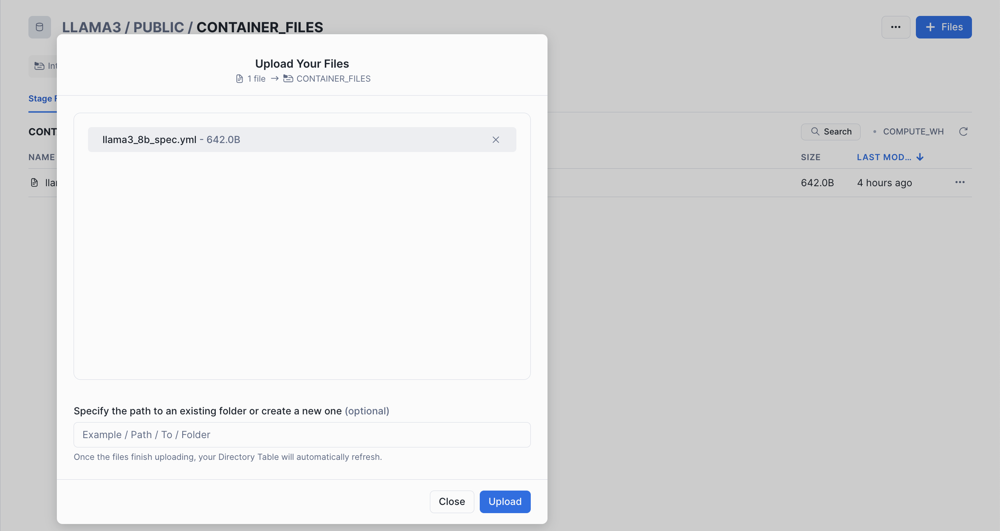

# META's Llama 3 in Snowpark Container Services
This repository explains how to run META's [Llama 3](https://llama.meta.com/llama3/) in Snowpark Container Services.  
You can access the related blog article here:  
[Llama 3 in Snowflake](https://medium.com/@michaelgorkow/496863631700?source=friends_link&sk=c912452d8427d999f800777cc01f6d88)

## Requirements
* Snowflake Account with Snowpark Container Services
* Docker installed

## Setup Instructions
### 1. Setup the Snowflake environment
```sql
USE ROLE ACCOUNTADMIN;

CREATE DATABASE IF NOT EXISTS LLAMA3;
-- Stage where we'll store service specifications
CREATE STAGE IF NOT EXISTS LLAMA3.PUBLIC.CONTAINER_FILES
    ENCRYPTION = (TYPE = 'SNOWFLAKE_SSE') 
    DIRECTORY = (ENABLE = TRUE);
-- Stage where we'll store Llama 3 model files
CREATE STAGE IF NOT EXISTS LLAMA3.PUBLIC.LLAMA3_MODELS 
    ENCRYPTION = (TYPE = 'SNOWFLAKE_SSE') 
    DIRECTORY = (ENABLE = TRUE);

-- Create Compute Pool in which Llama 3 service will be executed
CREATE COMPUTE POOL LLAMA3_GPU_POOL
  MIN_NODES = 1
  MAX_NODES = 1
  INSTANCE_FAMILY = GPU_NV_S;

-- Create Image Repository
CREATE IMAGE REPOSITORY LLAMA3.PUBLIC.IMAGE_REPOSITORY;

-- Create External Access Integration (to download LLama 3 models)
CREATE OR REPLACE NETWORK RULE LLAMA3.PUBLIC.LLAMA3_NETWORK_RULE
    MODE = EGRESS
    TYPE = HOST_PORT
    VALUE_LIST = ('huggingface.co','cdn-lfs-us-1.huggingface.co');

CREATE OR REPLACE EXTERNAL ACCESS INTEGRATION LLAMA3_ACCESS_INTEGRATION
    ALLOWED_NETWORK_RULES = (LLAMA3.PUBLIC.LLAMA3_NETWORK_RULE)
    ENABLED = true;

-- Create a secret for downloading Hugging Face Models
CREATE SECRET LLAMA3.PUBLIC.HUGGINGFACE_TOKEN
    TYPE = GENERIC_STRING
    SECRET_STRING = 'hf_<your-token>'
    COMMENT = 'Hugging Face User Access Token';

-- Create a custom role for Llama 3 services
-- Grants for custom role to create and run Llama3 service
CREATE OR REPLACE ROLE LLAMA3_ROLE;
GRANT USAGE ON DATABASE LLAMA3 TO ROLE LLAMA3_ROLE;
GRANT USAGE ON SCHEMA LLAMA3.PUBLIC TO ROLE LLAMA3_ROLE;
GRANT READ ON IMAGE REPOSITORY LLAMA3.PUBLIC.IMAGE_REPOSITORY TO ROLE LLAMA3_ROLE;
GRANT CREATE FUNCTION ON SCHEMA LLAMA3.PUBLIC TO ROLE LLAMA3_ROLE;
GRANT CREATE SERVICE ON SCHEMA LLAMA3.PUBLIC TO ROLE LLAMA3_ROLE;
GRANT READ ON STAGE LLAMA3.PUBLIC.CONTAINER_FILES TO ROLE LLAMA3_ROLE;
GRANT READ, WRITE ON STAGE LLAMA3.PUBLIC.LLAMA3_MODELS TO ROLE LLAMA3_ROLE;
GRANT USAGE, OPERATE, MONITOR ON COMPUTE POOL LLAMA3_GPU_POOL TO ROLE LLAMA3_ROLE;
GRANT USAGE ON NETWORK RULE LLAMA3.PUBLIC.LLAMA3_NETWORK_RULE TO ROLE LLAMA3_ROLE;
GRANT USAGE ON INTEGRATION LLAMA3_ACCESS_INTEGRATION TO ROLE LLAMA3_ROLE;
GRANT USAGE ON SECRET LLAMA3.PUBLIC.HUGGINGFACE_TOKEN TO ROLE LLAMA3_ROLE;
GRANT READ ON SECRET LLAMA3.PUBLIC.HUGGINGFACE_TOKEN TO ROLE LLAMA3_ROLE;
GRANT ROLE LLAMA3_ROLE TO USER ADMIN; --add your username here
```

### 2. Clone this repository
```bash
git clone https://github.com/michaelgorkow/scs_llama3.git
```

### 3. Build & Upload the container
```cmd
cd scs_llama3
docker build --platform linux/amd64 -t <ORGNAME>-<ACCTNAME>.registry.snowflakecomputing.com/LLAMA3/PUBLIC/IMAGE_REPOSITORY/llama3_service:latest .
docker push <ORGNAME>-<ACCTNAME>.registry.snowflakecomputing.com/LLAMA3/PUBLIC/IMAGE_REPOSITORY/llama3_service:latest
```

### 4. Upload the Service Specification
You can use Snowflake's UI to upload the llama3_8b_spec.yml to @LLAMA3.PUBLIC.CONTAINER_FILES.  


### 5. Create the Llama 3 Service
```sql
-- Create Llama 3 service
CREATE SERVICE LLAMA3.PUBLIC.LLAMA3_8B_SERVICE
  IN COMPUTE POOL LLAMA3_GPU_POOL
  FROM @LLAMA3.PUBLIC.CONTAINER_FILES
  SPEC='llama3_8b_spec.yml'
  MIN_INSTANCES=1
  MAX_INSTANCES=1
  EXTERNAL_ACCESS_INTEGRATIONS = (LLAMA3_ACCESS_INTEGRATION);

-- Verify Service is running
SELECT SYSTEM$GET_SERVICE_STATUS('LLAMA3_8B_SERVICE');
-- View Service Logs
SELECT SYSTEM$GET_SERVICE_LOGS('LLAMA3_8B_SERVICE',0,'llama3-8b-service-container');
```

### 6. Create the service functions
```sql
-- Create service function for simple function
CREATE OR REPLACE FUNCTION LLAMA3.PUBLIC.LLAMA3_8B_COMPLETE(INPUT_PROMPT TEXT)
RETURNS TEXT
SERVICE=LLAMA3.PUBLIC.LLAMA3_8B_SERVICE
ENDPOINT=API
AS '/complete';

-- Create service function for Matillion Prompt
CREATE OR REPLACE FUNCTION LLAMA3.PUBLIC.LLAMA3_8B_MATILLION_PROMPT(SYSTEMPROMPT TEXT, USERPROMPT TEXT, INPUTPROMPT TEXT, INPUTVALUES VARIANT, METADATA VARIANT)
RETURNS TEXT
SERVICE=LLAMA3.PUBLIC.LLAMA3_8B_SERVICE
ENDPOINT=API
AS '/matillion_prompt';
```

### 7. Call the service functions
```sql
-- Chat with Llama 3 with default settings:
SELECT LLAMA3.PUBLIC.LLAMA3_8B_COMPLETE('Generate the next 3 numbers for this Fibonacci sequence: 0, 1, 1, 2') AS RESPONSE;

-- Define system_prompt, max_token, temperature and top_p yourself:
-- Mock the call coming from the Matillion AI prompt components:
-- SYSTEMPROMPT TEXT, USERPROMPT TEXT, INPUTPROMPT TEXT, INPUTVALUES VARIANT, METADATA VARIANT
SELECT LLAMA3.PUBLIC.LLAMA3_8B_MATILLION_PROMPT(
    'You are a data analysis and exploration tool. You receive a context prompt from the user, a data object, and an output format.
Generate the output in a valid JSON format, including only the output variables without any headers or explanations.
Escape any values which would not be valid in a JSON string, such as newlines and double quotes.', 
    'You are a marketing analyst reviewing user comments from a well-known barista company.',
    '"anger_reason":"Give a single word describing the reason why the user is angry. In the case of a positive review, keep the field blank. Remember, not two words, just ONE!","anger_score":"Give a score between 0 and 10 on the level of anger you feel in the user review. Only use integers.","sentiment":"Answer by POSITIVE, NEUTRAL or NEGATIVE based on the sentiment of the user comment. Make sure your answer is in capital letters.","wont_return":"Answer YES if the user indicates that they will never come again to the shop. Otherwise, answer NO","product_involved":"Extract the product name involved in the user comment. Keep the field blank if you cant find any.","anger_summary":"Give a humorous summary of the user comment, in a single sentence that could have been written by a barista. Remember to keep it really fun!","swear_words":"Answer YES if you found swear words in the user review. Otherwise, answer by NO"',
    TO_VARIANT(PARSE_JSON('{"data object":
    {"name":"Andrew-3cb1d5d0d4bba0f246364cffb7981ab9cdd9c059","review":"No Review Text"}}')), 
    NULL) AS RESPONSE;
```

## Demo Video
https://www.loom.com/share/d1a853a4e3ef421c81cd6ea8fc35094c

